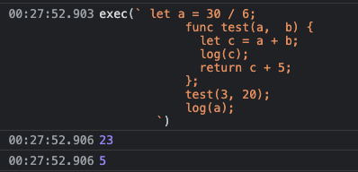

# umi project

## Getting Started

Install dependencies,

```bash
$ yarn
```

Start the dev server,

```bash
$ yarn start
```
## TODO 
## 目前进度


### 主要逻辑大概流程
1. 词法分析
   * 对语言所有内容进行分析判断对应类型，关键字 ｜ 数字 ｜ 字符串 ｜ 变量名
2. 语法分析
    * 参考babel格式分析生成ast 在线地址： https://astexplorer.net/
    * 表达式处理
    * 函数
      * 参数
      * return
    * if
      * if内嵌表达式
      * if内return
    * 适配其他数据类型
      * 数组
      * 对象
3. 编辑器
    * 高亮语法
    * 语法提示
    * 错误提示
4. 代码执行
    * 表达式（!2-1+1*3/2-(5-3*2)）
      * 前序 !2| -4  
      * 中序 3-2+(5+2)*2
    * 函数执行
      * 闭包
      * 递归
      * 符号表 需提前
      * 普通函数
   
File                  | % Stmts | % Branch | % Funcs | % Lines | Uncovered Line #s                 
----------------------|---------|----------|---------|---------|-----------------------------------
All files             |   56.06 |    53.01 |   76.92 |   56.48 |                                   
 common               |   96.87 |    85.71 |     100 |     100 |                                   
  arraytoGenerator.ts |     100 |      100 |     100 |     100 |                                   
  enum.ts             |     100 |      100 |     100 |     100 |                                   
  peekIterator.ts     |   96.42 |    85.71 |     100 |     100 | 40,54                             
 lexer                |   50.43 |       50 |   68.42 |   50.64 |                                   
  AlphabetHelper.ts   |     100 |      100 |     100 |     100 |                                   
  Lexer.ts            |   83.67 |    85.71 |     100 |   85.41 | 35,44-46,64-66                    
  LexicalException.ts |   33.33 |      100 |      50 |   33.33 | 4-5                               
  Token.ts            |   38.59 |       33 |   54.54 |   38.59 | ...78,183-231,234,239,244-283,300 
  TokenType.ts        |     100 |      100 |     100 |     100 |                                   
Test Suites: 2 passed, 2 total
Tests:       5 passed, 5 total
Snapshots:   0 total
Time:        1.658 s
